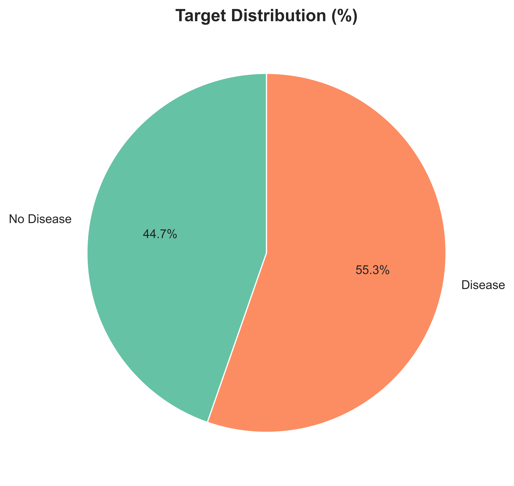

# Gender-Based Comparative Analysis of Heart Disease Prediction Models

**Author:** Umair Akram

**Course:** DV2638 - Machine Learning  

**Institution:** Blekinge Institute of Technology (BTH)  

**Date:** January 9, 2026

---

## 1. Project Overview

This project implements a comprehensive two-stage machine learning analysis to investigate and compare heart disease prediction models across genders. Heart disease symptoms and risk factors often manifest differently in men and women, yet many predictive models are trained on gender-imbalanced datasets. 

The study employs three primary algorithms:
- **Logistic Regression**
- **Random Forest**
- **XGBoost**

The goal is to determine whether gender-specific models provide superior predictive performance compared to unified approaches and to analyze the impact of data balancing techniques.

### Methodology
The analysis is structured in two stages:
1.  **Stage 1:** Train and compare models on the original, potentially imbalanced gender-specific datasets.
2.  **Stage 2:** Perform a fair cross-gender comparison using two sampling strategies (Oversampling and Undersampling) to mitigate class imbalance.

## 2. Dataset Information

The project utilizes the **Heart Disease Dataset** from the UCI Machine Learning Repository. It combines data from four locations:
- Cleveland Clinic Foundation
- Hungarian Institute of Cardiology
- University Hospital, Zurich, Switzerland
- V.A. Medical Center, Long Beach, CA

**Key Attributes:**
- **Target Variable:** Binary classification (1 = Presence of Heart Disease, 0 = Absence)
- **Key Feature:** Gender (1 = Male, 0 = Female)
- **Total Samples:** Aggregated from the four sources (Cleveland, Hungarian, Switzerland, VA).

## 3. Installation & Prerequisites

The project requires **Python 3.8+**. All dependencies are listed in `requirements.txt`.

### Dependencies
- pandas
- numpy
- matplotlib
- seaborn
- scikit-learn
- xgboost
- imbalanced-learn
- joblib
- scipy

### Setup Instructions

1.  **Clone or download the repository.**
2.  **Install the required packages:**
    ```bash
    pip install -r requirements.txt
    ```

## 4. Usage

The core analysis is contained within a Jupyter Notebook.

1.  **Launch Jupyter Notebook:**
    ```bash
    jupyter notebook heart_disease_analysis.ipynb
    ```
2.  **Run the analysis:**
    Execute all cells in the notebook to reproduce the data preprocessing, model training, and visualization steps.

## 5. Visualizations & Results

The project generates several key visualizations to understand data distribution and model performance.

### Data Distribution
*Distribution of the target variable and gender demographics.*


*Figure 1: Distribution of Heart Disease (Target) in the dataset.*


*Figure 2: Pie chart view of the target distribution.*


*Figure 3: Distribution of samples across genders.*

### Feature Analysis
*Correlation between features and their distribution across genders.*


*Figure 4: Correlation heatmap of dataset features.*


*Figure 5: Distribution of key features split by gender.*

### Model Performance
*Comparison of model performance metrics (Accuracy, Precision, Recall, F1-Score).*


*Figure 6: Performance of models trained on male data.*


*Figure 7: Performance of models trained on female data.*

### Final Comparison
*Aggregate results and feature importance analysis.*


*Figure 8: Comprehensive comparison of model performance across strategies.*


*Figure 9: Detailed feature importance breakdown.*


*Figure 10: Comparison of top features influencing predictions for males vs. females.*

## 6. Project Structure

```
Project Root/
│
├── heart_disease_analysis.ipynb    # Main Jupyter notebook (Analysis & Modeling)
├── requirements.txt                # Python dependencies
├── README.md                       # Project documentation
├── README.txt                      # Original project info
│
├── Dataset Old/                    # Raw Dataset Directory
│   └── heart+disease/              # UCI Heart Disease Data files
│
├── images/                         # Generated plots and visualizations
│   ├── target_distribution.png
│   ├── feature_correlation_plot.png
│   └── ... (other visualization files)
│
└── models/                         # Serialized (Pickled) trained models
    ├── stage1_best_male_rf.pkl
    ├── stage1_best_female_lr.pkl
    └── ... (other model files)
```

## 7. License & Contact

This project was developed for the Machine Learning course at Blekinge Institute of Technology.
